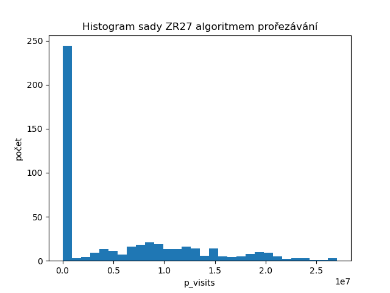
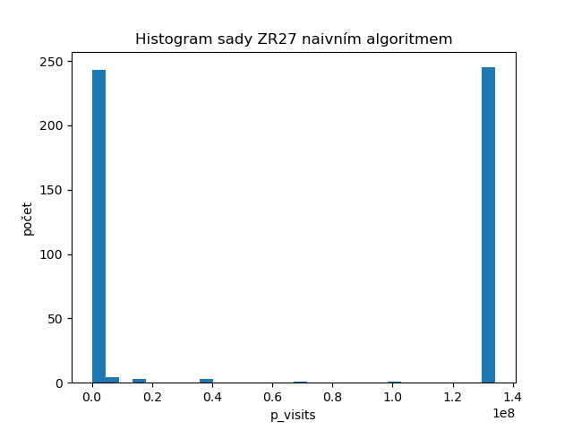

<link rel="stylesheet" type="text/css" href="pandoc.css"/>

Problém batohu
==============

Definice problému
-----------------

Je daná množina předmětů s váhou a cenou. Úkolem je najít takovou podmnožinu, aby součet váh byl do maximální povolené váhy a zároveň celková cena podmnožiny byla alespoň taková, jaká je zadaná na vstupu (rozhodovací problém).

Implementace
------------

Program je napsán v jazyce Rust. To je relativně nový jazyk. V rychlosti se mu daří konkurovat nízkoúrovnovým jazykům (ve většině benchmarcích vychází o trošku hůře než C++), ale píše se v něm spíše tak, že se to podobá vysokoúrovnovým. Má propracovaný pamětový model, a tak je to jeden z mála jazyků, který je pamětově bezpečný a zároveň nemá garbage collector.

Program se zkompiluje pomocí pomocného programu `cargo`, který je běžnou součástí jazyka. Funguje na stabilní verzi Rustu. Vybuildí se pomocí příkazu `cargo build --release` (to release je důležité kvůli optimalizacím, neoptimilizované programy jsou v rustu velmi pomalé).

Pro spuštění potřebuje argumenty, povinný je soubor se zadáním, volitelným argumentem je soubor pro kontrolu nalezených cen. Je v něm vestavěno měření času, ve kterém se počítá pouze čas pro rekurzivní navštěvovací funkci.

Je potřeba mu zadat, který engine má použít pro procházení prostoru. Aktuálně je k dispozici hrubá síla (pomocí argumentu `--naive`) a prořezávání (`--pruning`). Jde také vynutit kontrukční řešení pomocí `--force-construction`, ikdyž zadání říká, že by mělo být rozhodovací (opačně to nejde, protože chybí cílová cena).

Příklad zadání argumentů: `knapsack ../NR32_inst.dat --pruning`

Výstup programu
---------------

Na prvním řádku je `time`, to je čas na vyhodnocení jednoho problému, bez počítání doby na načtení a vypsání. Dále tam je `visits`, což je návštěva koncových konfigurací. Poslední na prvním řádku je `p_visits`, což je počet navštívených nekoncových vrcholů.

Na dalším řádku je vypsané řešení ve stejném formátu, v kterém je v zadání. Tedy postupně `id`, `size`, `cost` a `1/0` znázornující, jestli předmět do výsledké konfigurace patří a nebo nepatří. V případě nenalezení řešení v rozhodovacím problému je `cost` nula a bity znázurnující konfiguraci nejsou vypsány. V případě konstruktivní úlohy s porovnáváním, jestli našel správné řešení může být vypsána hláška `Same cost, but different solution!` - tedy výsledné naskládání předmětů bylo jiné, než v referenčním řešení, ale dalo to správnou cenu.

Na posledním řádku je Celkový čas, který je vypočítán jako součet všech `time` jednotlivých podúloh.

```
time: 60.762µs visits: 93 p_visits: 9332
493 25 28680 1 0 1 1 1 0 1 1 1 0 1 1 1 0 1 1 0 1 1 0 0 0 1 1 1
time: 298ns visits: 0 p_visits: 1
496 25 0
...
Maximum time: 1.420254ms Average time: 11.261µs
Total time: 5.630666ms
```

Naivní algoritmus
-----------------

První jsem implementoval naivní algoritmus, ten zkouší každou iteraci rekurzivním průchodem. Po cestě si nasčítává cenu a váhu přidaných itemů, nicméně až nakonci se rozhoduje, jestli překročil váhu, a jestli má maximální cenu. V případě nenalezení řešení, tak platí `visits` = $2^n$ a `p_visits` = $2^n-1$.

Prořezávací algoritmus
----------------------

Funkčnost tohoto algoritmu je podobná jak naivní až na dvě optimalizace. Průběžně zkouší, jestli překročil váhu a při překročení nepokračuje. Navíc kontroluje jestli ve zbývajicích předmětech je dostatečná hodnota na překročení minimální akceptovatelné ceny (u konstruktivní verze to je aktuálně maximální nalezené cena), a když není tak se také ukončí.

Porovnání implementací
----------------------

Testování provádím na notebooku s procesorem `i5-8350U` a dostatkem RAM paměti na operačním systému ArchLinux. Při měření dbám akorát na to, aby notebook byl pokaždé zapojen do síťě a teda se nesnažil šetřit energii. Vzhledem k tomu, že u rozhodovací verze v prořezávacím algoritmu se navštíví hodně málo konfigurací a není to moc vypovídající výsledek, tak jsem se rozhodl radši měřit čas.

Už z prvotního spouštění jde poznat, že rozdíly implementovaných algoritmů jsou velké. Například testování celého souboru `NR25_inst.dat` ze zadání trvá naivní implementaci celkově 53 sekund a prořezávacímu algoritmu 22 až 42 ms. Úplně nevím, čím je způsobený takový rozsah, ale mám podezření na to, že se to stane, když nepěkně vyjde přerušení od OS - meřím reálný čas a nikoliv procesorový čas.

| instance | maximální čas | průměrný čas | maximální čas | průměrný čas |
|:--------:|--------------:|-------------:|--------------:|-------------:|
|          |  naivní       | naivní       | prořezávání   | prořezávání  |
| `NR22_inst.dat` | $34,7ms$ | $15,8ms$ | $1,42ms$ | $11,2µs$ |
| `NR25_inst.dat` | $242,1ms$ | $127,3ms$ | $2,42ms$ | $38,9µs$ |
| `NR27_inst.dat` | $960,5ms$ | $503,2ms$ | $3.62ms$ | $59,8µs$ |
| `NR30_inst.dat` | $7,52s$ | - | $17,1ms$ | $170,5µs$ |
| `NR32_inst.dat` | $30s$ | - | $58,3ms$ | $572,8µs$ |
| `NR35_inst.dat` | $238s$ | - | $96,9ms$ | $1,29ms$ |
| `NR37_inst.dat` | - | - | $417,6ms$ | $2,89ms$ |
| `NR40_inst.dat` | - | - | $1,76s$ | $12,4ms$ |
| |
| `ZR22_inst.dat` | $36,9ms$ | $14,7ms$ | $5,03ms$ | $1,09ms$ |
| `ZR25_inst.dat` | $240,7ms$ | $115,2ms$ | $35,3ms$ | $7,61ms$ |
| `ZR27_inst.dat` | $969,3ms$ | $461,4ms$ | $122,9ms$ | $26,1ms$ |
| `ZR30_inst.dat` | $7,52s$ | - | $989,4ms$ | $159,5ms$ |
| `ZR32_inst.dat` | $30s$ | - | $3,38s$ | $574,3ms$ |

Od `NR30_inst.dat` přestává být měření všech instancí na naivním algoritmu časově rozumné - jakmile úloha nemá řešení, tak to trvá téměř ten maximální čas. Od `NR37_inst.dat` přestává být rozumné i měření maximálního času, ale dá se očekávat, že by bylo asi 15 minut. Zatím prořezávací algoritmus se nedostal ani přes sekundu.

Vyhodnocení sad `ZR` bylo už horší. Naivní dopadlo přibližně stejně, ale prořezávání tam už nefunguje tak rychle, proto jsem to vyhodnotil jen do velikosti 32.

Následuje tabulka s `p_visits`. Téměř odpovídá čas s `p_visits`, jde to například vidět v prořezávání mezi sadou `NR35_inst.dat` a `ZR22_inst.dat`. Obě sady mají `p_visits` lehce přes 200 tisíc a obě trvají v průměru něco přes `1ms`. Dokonce to jde porovnávat i mezi algoritmy. Když vemu naivní algoritmus a sadu `NR22_inst.dat` oproti prořezávání a sadu `NR40_inst.dat`, tak oboje má `p_visits` lehce přes 2 miliony a čas mezi `10ms` a `20ms`. Pro instance velikosti větší než 30 jsou maximální `p_visits` vypočítáno jako $2^{size}-1$, což je případ, kdy řešení neexistuje.

| instance | maximální p_visits | průměrný p_visits | maximální p_visits | průměrný p_visits |
|:--------:|--------------:|-------------:|--------------:|-------------:|
|          |  naivní       | naivní       | prořezávání   | prořezávání  |
| `NR22_inst.dat` | 4 194 303 | 2 247 116,5 | 83 238 | 1 231,2 |
| `NR25_inst.dat` | 33 554 431 | 18 294 550 | 392 621 | 5 501,6 |
| `NR27_inst.dat` | 134 217 727 | 72 618 380 | 437 466 | 8 207,8 |
| `NR30_inst.dat` | 1 073 741 823 | - | 3 401 191 | 29 985,8 |
| `NR32_inst.dat` | 4 294 967 295 | - | 11 924 299 | 108 674,1 |
| `NR35_inst.dat` | 34 359 738 367 | - | 20 230 729 | 238 776,3 |
| `NR37_inst.dat` | 137 438 953 471 | - | 91 246 588 | 575 586,4 |
| `NR40_inst.dat` | 1 099 511 627 775 | - | 342 530 152 | 2 426 381,5 |
| |
| `ZR22_inst.dat` | 4 194 303 | 2 090 824,3 | 1 289 437 | 269 337,7 |
| `ZR25_inst.dat` | 33 554 431 | 16 620 486 | 7 790 219 | 1 701 290,3 |
| `ZR27_inst.dat` | 134 217 727 | 66 549 724 | 27 045 462 | 5 861 207 |
| `ZR30_inst.dat` | 1 073 741 823 | - | 221 313 997 | 36 442 904 |
| `ZR32_inst.dat` | 4 294 967 295 | - | 769 295 054 | 132 466 840 |

Z uvedených čísel jde vidět, že naivnímu řešení je jedno jakou sadu řeší a trvá pořád přibližně stejně. Naopak prořezávání dává sada `ZR` mnohem víc zabrat a už od velikosti 27 je řešení průměrně delší než největší možné zadání sady `NR`, které je velikosti 40.




Z histogramů je zřejmý rozdíl mezi algoritmy. Naivní, když instance řešení nemá, tedy skončí v posledním binu. Zatímco u prořezávání se to nedá odhadnout, protože tam jsou instance, u kterých se prostor téměř neprohledává, protože ceny téměř nedají dohromady ani `min_price`.


Prostor k vylepšení
-------------------

Rust při přístupu do pole dělá automaticky kontrolu hranic a při failnutí spadne - tedy bylo by možné toto deaktivovat, nicméně výrazně se tím zhorší čitelnost kódu. Je potřeba ten přístup obalit do `unsafe` a místo `[]` použít metodu `get_unchecked` nebo `get_unchecked_mut` (podle toho, jestli tam chci zapisovat a nebo jen číst).
